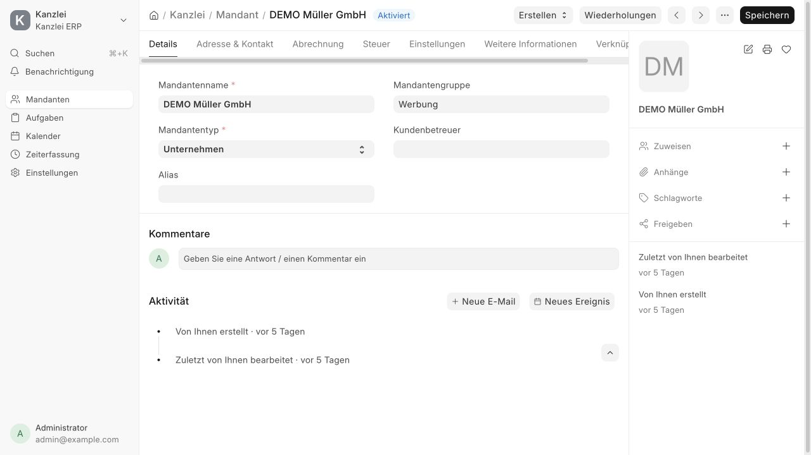

# Проверка упрощения интерфейса BL-033–038

Дата: **4 октября 2026 года**. Среда: локальный `development.localhost`, Frappe/ERPNext 16, Kanzlei ERP. Историческое [ревью FiBu от 3 октября](2026-10-03-fibu-before-datev-review.md) сохранено без изменений.

Изменения ограничены интерфейсом приложения. Стандартные DocType, модули, права, статусы и генератор повторений сохранены. Начальная страница — Mandanten; Übersicht, FiBu-Perioden, Eingang и Rückfragen еще не реализованы.

## Реализация

- [Property Setter fixtures](../../kanzlei_erp/fixtures/property_setter.json): скрытие торговых полей/секций Customer, Abrechnung, Account Manager в Details, полный `field_order` Customer и Task, Erweitert на существующей вкладке Dependencies, условная ссылка на повторение и упрощенное быстрое создание Task. В порядке сохранены все текущие стандартные поля и четыре пользовательских поля Task. Frappe сохраняет дополнительные поля при применении `field_order`.
- [Customer doctype_js](../../kanzlei_erp/public/js/customer.js) и [hook](../../kanzlei_erp/hooks.py): Abrechnung для Administrator/System Manager, очистка торговых/платежных кнопок, финансовых отчетов и индикаторов при каждом refresh, фильтр повторений текущего Mandant и создание с заполненным клиентом при наличии права.
- [Sidebar Kanzlei](../../kanzlei_erp/workspace_sidebar/kanzlei.json), [Einstellungen](../../kanzlei_erp/workspace_sidebar/einstellungen.json), [dashboard](../../kanzlei_erp/navigation.py): ежедневное меню Mandanten → Aufgaben → Kalender → Zeiterfassung → условная E-Mail; общий список повторений, счета и платежи в Einstellungen; Verknüpfungen содержит Task, Work Schedule и Timesheet.
- [README](../../README.md) и [эксплуатация](../production.md): новый рабочий маршрут, административная Abrechnung, обновление приложения и проверка в staging.

## Результаты

| Проверка | Результат |
|---|---|
| Обновленные тесты навигации до реализации | Выявили старые рабочие ссылки и финансовые связи; после реализации все 14 проходят |
| `bench --site development.localhost migrate` | Успешно выполнено три раза; окончательная конфигурация содержит 25 Property Setter |
| Повторная миграция окончательной конфигурации | Сравнение снимков подтвердило одинаковый полный порядок полей, значения setter, содержимое/порядок sidebar и значения всех Customer, Task и Work Schedule; дублей нет. Служебные ID дочерних строк sidebar исключены из сравнения |
| `bench build --app kanzlei_erp` | Успешная сборка assets и переводов |
| `bench --site development.localhost run-tests --app kanzlei_erp` | **36 успешных тестов**: 31 FrappeTestCase и 5 тестов recurrence; итоговый прогон после последней миграции |
| Проверки исходников | `node --check` Customer JS, `git diff --check` и Ruff F/E для измененных Python-файлов — успешно. Локальная версия Ruff не поддерживает конфигурацию `py314`; синтаксическая проверка выполнена с изолированной конфигурацией `py311` |
| Mandant в браузере Administrator | Создан, сохранен и повторно открыт искусственный клиент без Territory и остальных скрытых торговых полей; Account Manager в Details; Abrechnung содержит валюту, Firmenkonto, Price List и Payment Terms; Internal Customer отсутствует |
| Сохранение/refresh Mandant | Торговые и платежные действия, переходы к Accounts Receivable/General Ledger и финансовые индикаторы не возвращаются; контакты, адреса, Tax ID, общие сведения, комментарии, вложения и рабочие связи сохранены |
| Wiederholungen в браузере | Создание из Mandant подставило клиента; сохранение создало обычный Task. Клиентский список показал только его повторение (`1 von 1`), а существующее повторение другого клиента не попало в него |
| Task в браузере | Создана и повторно открыта обычная задача. Основной экран содержит рабочие поля, ссылка на Wiederholung появляется только при наличии; quick entry содержит Betreff и Mandant |
| Erweitert и сохранность | После сохранения/открытия и миграции сохранились Weight 2.5, Progress 35, Color, Milestone, зависимость, а также шаблон с Start 2 / Duration 5. Group/Template, Project/Issue/Type/Parent Task и зависимости доступны на Erweitert |
| Завершение Task | На основном экране появился обязательный Completed On; сохранение с датой завершило Task, стандартная логика установила Progress 100 |
| Административная и рабочая навигация в браузере | Открыты Rechnungen и Zahlungen из Einstellungen, календарь с названиями Mandant + работа, Zeiterfassung и переход из Task к Timesheet с фильтром |
| Сотрудник и почта | Автотесты реальной boot-сессии подтверждают рабочее меню без административных ссылок, отсутствие дублей, появление E-Mail только с назначенным аккаунтом и сохранение проверок доступа к переписке/вложениям |
| Дополнительное ревью | Чтение diff и установленного Frappe/ERPNext: ошибок, требующих исправления, не выявлено |
| Очистка | Удалены только созданные для проверки 5 Tasks, 1 Work Schedule и 1 Customer; исходные демонстрационные записи сохранены |

Браузерная проверка выполнена в существующей сессии Administrator. Создание отдельного временного сотрудника с ролями отклонила автоматическая проверка разрешений: получатель доступа сочтен неявно согласованным, в предложенном скрипте отсутствовала очистка пользователя. Пользователь и права не создавались. Ролевое меню и почтовые условия проверены автоматическими тестами; скрытие Abrechnung у сотрудника проверено по коду hook и ревью, но не в отдельной браузерной сессии. Проверка реального IMAP/SMTP не входит в этот этап; почтовая навигация и правила доступа сохранены.

Тестовый runner сообщает существующее предупреждение Frappe о deprecated `limit_page_length`; тесты завершились с `OK`.

## Статусы backlog

BL-033 и BL-034 закрыты по проверенному упрощению Mandantenakte и отдельной административной Abrechnung. BL-037 закрыт: Rechnungen исключены из ежедневной FiBu-подготовки, административный доступ сохранен; готовый процесс Steuerberater-Abrechnung не заявляется. BL-035 и BL-036 выполнены частично. BL-038 остается открытым до появления Übersicht и новых рабочих разделов.
