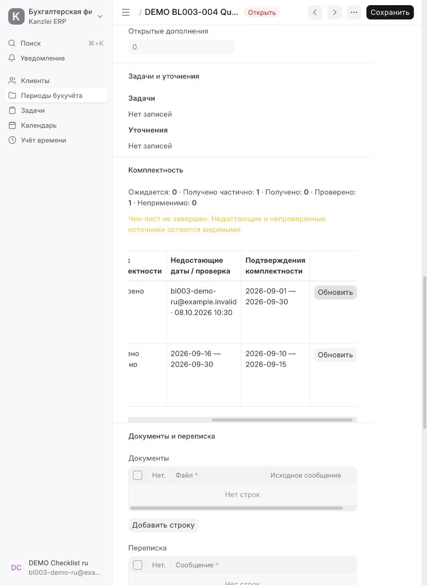
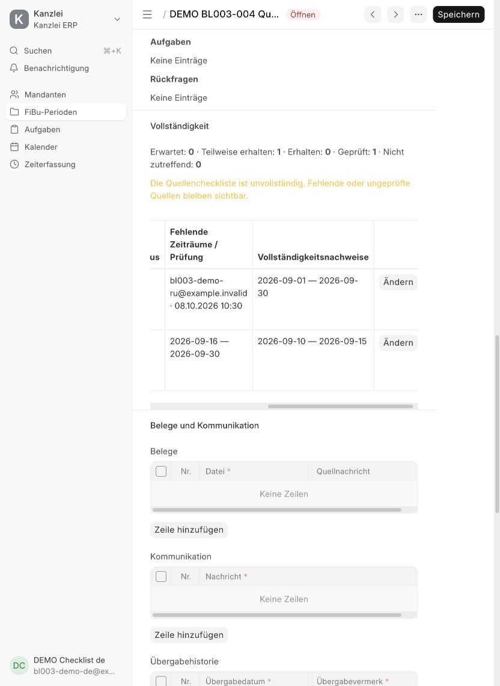

# Приемка BL-003 и BL-004 — 8 октября 2026 года

Источники Mandant и чек-лист комплектности реализованы для FiBu Package и FiBu Supplement. Источники имеют серверный постоянный идентификатор, категорию, название, даты действия и примечание. Период сохраняет снимок пересечения источников с учетным интервалом; последующие изменения Customer не переписывают этот снимок. Неприменимые категории не создаются автоматически.

## Рабочий сценарий в браузере

Локальная среда: `development.localhost`, искусственный клиент **DEMO BL003-004 Quellen GmbH**, услуга **DEMO BL003-004 FiBu**, сентябрьский пакет **g903fjgbnu**. Два тестовых сотрудника — `bl003-demo-ru@example.invalid` и `bl003-demo-de@example.invalid` — имеют Projects User, Sales User и Inbox User и Customer User Permission только на этот Mandant. Проверка выполнена в отдельных русской и немецкой сессиях без роли System Manager. Уведомления сотрудникам не отправлялись; использованы только искусственные документы. Сессия администратора восстановлена после приемки.

| Проверка | Наблюдаемый результат |
| --- | --- |
| Первый счет | Ожидается 01–30.09.2026; приватное подтверждение покрывает весь диапазон. Первоначальный статус «Получено» не считается проверкой. |
| Второй счет | Действует с 10.09.2026, ожидается 10–30.09; приватное подтверждение покрывает только 10–15.09. Статус «Получено частично», недостает **16–30.09.2026**. |
| Явная проверка | Русский сотрудник отдельно установил «Проверено» для первого счета; сервер зафиксировал `bl003-demo-ru@example.invalid` и время. Второй счет остался частичным. |
| Неверное подтверждение полноты | Немецкий сотрудник попытался установить «Erhalten» для второго счета. Сервер показал немецкую ошибку неполного покрытия; статус и недостающие даты сохранились. |
| Готовность с пробелом | Переход Review → Ready сохранился и показал предупреждение о незавершенном чек-листе. Недостающий диапазон продолжает отображаться после перехода и повторного открытия. |
| История | Показывает автора, время, статус до/после и подробности изменений. Проверка отделена от получения. |
| Карточка Mandant | Вкладка источников показывает два самостоятельных счета и дату действия второго. Вкладка документов показывает подтверждения с контекстом FiBu и сохранением дедупликации. |
| Ограниченный доступ | Немецкая сессия отклонила прямое открытие чужого пакета `p2mpv2hnj2` клиента DEMO Schneider e.K. |
| Переводы | Формы, статусы, предупреждения и ошибка неполного покрытия проверены на русском и немецком. |

Пакет оставлен открытым на стадии Ready: один источник проверен, второй частичен. Это позволяет повторно увидеть критерий приемки без подготовки данных. Скрипт [seed_fibu_checklist_demo.py](../../scripts/seed_fibu_checklist_demo.py) создает только локальные демонстрационные записи; временный пароль принимается через stdin и не записывается в репозиторий.

## Автоматическая проверка

Две последовательные `bench --site development.localhost migrate` успешно завершились, затем выполнена успешная `bench build --app kanzlei_erp`. Итоговый `bench --site development.localhost run-tests --app kanzlei_erp` — **112 успешных тестов: 91 Frappe integration test и 21 unit test**, в том числе 24 новых сценария комплектности. Синтаксис JS проверен через `node --check`; измененные Python-файлы проверены Ruff (F, E9, I), `git diff --check` без ошибок. Проведено независимое ревью серверных ограничений, доступа, копирования и интерфейса; блокирующих замечаний не осталось.

Покрыты отдельные источники разных клиентов, два счета и две карты, месячный/квартальный/годовой диапазоны, даты действия, неизменность снимка, разрывы и объединение подтверждений, отсутствие автоматического повышения статуса, сброс и повторная проверка, обязательная причина неприменимости и пустой состав. Проверены независимое дополнение, запрет повторного выбора исходного источника, закрытые записи, однократная инициализация исторических открытых периодов и свежий снимок при обычном копировании закрытого пакета.

Негативные сценарии отклоняют недоступные File и Communication, публичные файлы, опасные URL, подделку автора и времени (включая изменение микросекунд), удаление пунктов, прямое изменение истории и устаревшую версию. Доступ к сводке проверяется по сохраненному документу. Подтверждения через внешние URL и Communication без вложений попадают в документы Mandant, дедуплицируются и не выдаются за скачиваемые File.

В приемке также исправлены обнаруженные регрессии: нормализация browser/DB datetime при защите workflow-истории, корректный путь подключения workflow JS, исключение старого состояния и материалов из обычного копирования периода, и скрытие неназначенного почтового ящика по URL независимо от языка меню. Эти изменения включены в полный прогон.

## Совместимость и границы этапа

Миграция не заполняет старые периоды автоматически. Сотрудник отдельно инициализирует открытый период; повтор не создает дубли. Закрытый исторический период отображает «Комплектность ранее не фиксировалась». Исправления выполняются действиями с правом записи, блокировкой, `expected_modified` и неизменяемой историей; удаление пунктов не разрешено.

Неполный чек-лист предупреждает, но не блокирует Ready или закрытие. Обязательная Freigabe и решения по исключениям остаются BL-011. Источники пока общие для FiBu Mandant; распределение по согласованным услугам относится к дальнейшему расширению профиля. Сохранность оригиналов и прочие задачи приема документов не объявляются выполненными этим этапом.

**Критерии BL-003 и BL-004 выполнены.**
