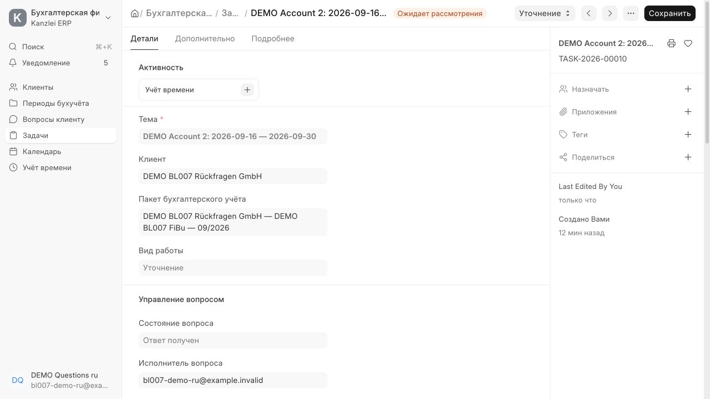
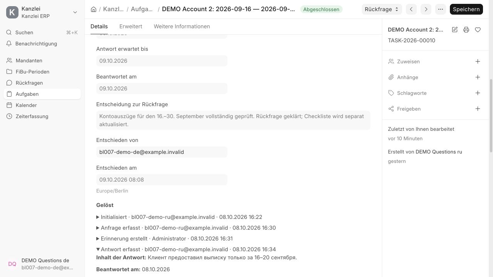
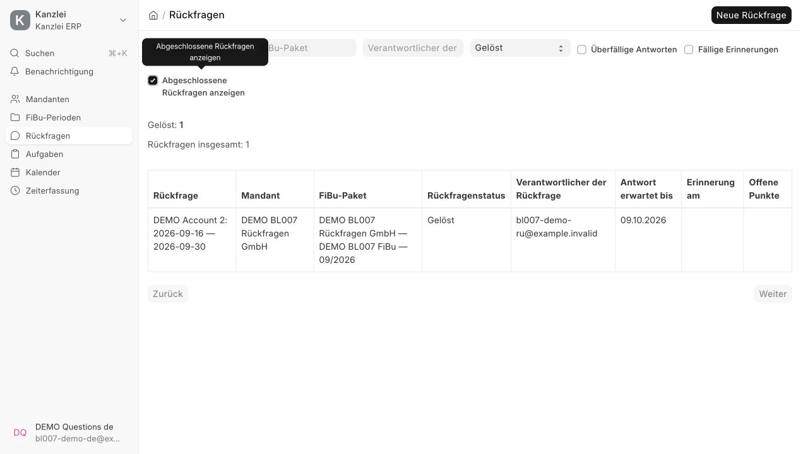

# BL-007 — Приемка управления Rückfragen

Проверки начаты 8 октября 2026 и продолжены 9 октября. Локальный сайт
`development.localhost`, ERPNext/Frappe 16, искусственные данные.

**Статус: критерии BL-007 выполнены 9 октября 2026.** Миграция,
сборка, целевые и полные тесты, параллельные транзакции и браузерная приемка
сотрудника/заместителя на RU/DE подтверждены. BL-007 отмечен выполненным.

## Реализовано

- Управляемая Task типа Question; основной исполнитель, Contact, даты,
  постоянный ключ источника, приватный File, контекст операции и итоговое решение.
- Отдельные состояния Draft, Waiting, Answer Received, Resolved, Cancelled;
  штатный Overdue сохраняет смысл вопроса. Ответ не завершает вопрос.
- Ручные запросы/ответы, обязательный остаток частичного ответа, причины отмены
  и повторного открытия; неизменяемая дочерняя история с серверными отметками.
- API создания, действий и доступного обзора с пагинацией; блокировки
  Package → Supplement → Task, проверка версии и идемпотентное создание.
- Форма вопроса, списки периода/дополнения, создание из источника чек-листа,
  Desk Page Rückfragen, рабочее меню и переводы RU/DE.
- Daily Alert без email, атомарный маркер цикла и событие Reminder Sent.
  При конфликте базы весь background job откатывается и повторяется средствами
  Frappe; уведомления и история не остаются частично сохраненными.
- Защита обычного сохранения, массового завершения Task/Project, самостоятельных
  API дочерней истории и автоматической выдачи доступа при назначении.
- Закрытие периода/дополнения проверяет собственное состояние управляемого
  вопроса дополнительно к Task.status; стандартные зависимости сохранены.
- Старые вопросы явно инициализируются сотрудником; копии начинают новую работу.

## Автоматические проверки

Последний целевой прогон: **21 тест, OK**. Итоговая последовательность
`bench --site development.localhost migrate` → `bench build --app kanzlei_erp`
→ `bench --site development.localhost run-tests --app kanzlei_erp`:
**112 интеграционных + 21 unit = 133 теста, OK**. Проверены результаты обеих
категорий в журнале, а не только код возврата bench. Миграция и сборка успешны.

Проверены целевыми тестами:

| Критерий | Результат |
|---|---|
| Полный цикл, частичный ответ, повторный запрос и несколько ответов | OK |
| Независимое завершение двух вопросов на одной Communication | OK |
| Решение без ответа, обязательные причины cancel/reopen | OK |
| Прямое/массовое завершение, подделка метаданных и удаление истории | OK |
| Подмена имен дочерних событий и смена типа/контекста/template | OK |
| Обход завершением Project, собственное состояние при закрытии и обзоре | OK |
| Сотрудник с доступом, отказ чужому Mandant, приватному File и переписке | OK |
| Стандартное назначение не создает доступ к чужому вопросу | OK |
| Инициализация legacy проверяет уже существующие назначения и DocShare | OK |
| Отключенный исполнитель: нет уведомления, проблема видна в обзоре | OK |
| Stale modified, повторный creation_key, Overdue и копирование | OK |
| Стандартные зависимости и закрытие назначений при решении | OK |
| Одно напоминание на цикл, новый цикл после изменения даты | OK |
| Описание операции не перезапускает уже отправленное напоминание | OK |
| Ошибка записи истории откатывает Notification Log и маркер | OK |

`ruff --isolated --select F,E9,I`, `node --check` измененных JS и
`git diff --check` проходят на проверенной версии.

## Параллельные транзакции

`scripts/seed_fibu_questions_demo.py` запускает два worker с отдельными
соединениями Frappe/MariaDB на искусственном периоде. Два завершенных прогона:

- Одновременное создание с одним ключом возвращает одну Task.
- Из двух действий с одним modified сохраняется одно; второе получает
  локализованную ошибку устаревшей версии.
- Два обработчика создают одну Notification Log и одно событие Reminder Sent.

При MariaDB 1020 повторяется новый запрос с тем же ключом после отката
предыдущего запроса. Для reminder используется полный retry background job;
в этом окружении даже snapshot conflict инвалидирует savepoint.
Конкурентные искусственные вопросы отменены с причиной; история сохранена.

## Браузерная приемка RU/DE

Искусственный Mandant: `DEMO BL007 Rückfragen GmbH`, период `tq02bufjtt`,
сентябрь 2026. Пользователи `bl007-demo-ru@example.invalid` и
`bl007-demo-de@example.invalid` имеют доступ только к этому Mandant;
RU — ответственный, DE — заместитель. Пароли в документацию не сохраняются.

Русская часть проверена в браузере сотрудника:

1. Из второго источника чек-листа создана `TASK-2026-00010`, содержание
   автоматически содержит недостающую выписку за **16–30 сентября**.
2. Зафиксирован телефонный запрос Contact, дата 8 октября, срок 9 октября
   и напоминание 8 октября. Состояние Waiting / Working.
3. После запуска обработчика видно русское внутреннее уведомление со ссылкой
   на Task и событие «Напоминание создано» в истории.
4. Зафиксирован частичный ответ за 16–20 сентября и остаток «Запросить и
   проверить выписку за 21–30 сентября». Состояние Answer Received /
   Pending Review; дата напоминания очищена.
5. Период остается Open / Sammlung, ожидание клиента не меняется. Источник
   остается Partially Received с прежней недостающей частью **16–30 сентября**.
6. Повторный запрос за 21–30 сентября возвращает Waiting и сохраняет первый
   запрос, напоминание и частичный ответ в истории.

Немецкая часть проверена под DE заместителем:

1. Заместитель видит содержание, ответственного, остаток вопроса и всю историю.
   Детали русского частичного ответа показывают «Teilweise beantwortet: Ja» и
   переход «Antwort ausstehend → Antwort erhalten»; даты отображаются локально.
2. Зафиксирован второй полный ответ за оставшиеся 21–30 сентября, дата 9 октября.
   Состояние «Antwort erhalten» / Pending Review; вопрос еще не завершен.
3. Действием «Rückfrage lösen» сохранено обязательное решение:
   «Kontoauszüge für den 16.–30. September vollständig geprüft. Rückfrage geklärt;
   Checkliste wird separat aktualisiert.» Состояние «Gelöst» / Completed.
   Сервер сохранил DE сотрудника и время **09.10.2026 08:08 Europe/Berlin**.
4. В истории семь событий: создание, первый запрос, напоминание, частичный ответ,
   повторный запрос, полный ответ и подтвержденное решение. Первый ответ и запрос
   сохранены после решения.
5. По умолчанию обзор Rückfragen не показывает завершенные вопросы. Включение
   закрытых и фильтр «Gelöst» показывают только решенную тестовую Task, ее Mandant
   и понятное название периода. Остаток и напоминание пусты. Навигационная ссылка
   Rückfragen, фильтры и подписи отображаются на немецком.

Финальное независимое read-only ревью не выявило критических регрессий в
проверках доступа, legacy initialization, Project bulk action и отображении
контекста. Временная тестовая вкладка и alias сайта удалены после приемки.
Искусственные записи оставлены для воспроизведения; исходная сессия
Administrator не изменена.

## Границы этапа

Чек-лист, ожидание Mandant и стадия периода меняются вручную. Переписка не
отправляется и не распознается автоматически. BL-008–009, BL-011, BL-030 и
BL-038 остаются открытыми. README и план реализации сохранены.
